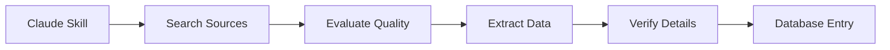

# ICE/CBP Activity Monitoring & Documentation Template

[](https://opensource.org/licenses/MIT)
[](https://github.com/TitusThrasher/ClaudeSkills/releases)
[](https://claude.ai)

> A customizable Claude AI skill template for systematic monitoring and documentation of immigration enforcement activity in your local area.

**Created by:** [Andrew Thrasher](https://linkedin.com/in/andrewmthrasher) | [Titus Legal Design](https://tituslegaldesign.com)

---

## 🎯 Quick Start

**⚠️ This is a template!** It requires customization before use.

```bash
# 1. Clone this repository
git clone https://github.com/TitusThrasher/ClaudeSkills.git
cd ClaudeSkills

# 2. Customize for your location (30-60 minutes)
# 3. Upload to Claude
# 4. Start monitoring
```

👉 **Start here:** [CUSTOMIZATION_GUIDE.md](CUSTOMIZATION_GUIDE.md) | **Fast track:** [QUICK_START.md](QUICK_START.md)

---

## 📖 Table of Contents

- [What This Template Does](#what-this-template-does)
- [Key Features](#key-features)
- [How It Works](#how-it-works)
- [Installation](#installation)
- [Usage Examples](#usage-examples)
- [Data Structure](#data-structure)
- [File Structure](#file-structure)
- [Customization](#customization)
- [Contributing](#contributing)
- [FAQ](#faq)
- [Support](#support)
- [License](#license)

---

## What This Template Does

This Claude skill provides two core capabilities for monitoring ICE and CBP enforcement:

### 🔍 **Search & Monitor**
- Systematically searches news outlets, social media, legal sources, and community organizations
- Evaluates source quality and prioritizes findings
- Identifies patterns and tracks enforcement trends
- Supports daily quick checks (15 min) and weekly deep dives (60 min)

### 📝 **Extract & Document**
- Extracts structured data from social media alerts, news articles, and legal documents
- Processes bilingual content (template includes Spanish patterns)
- Creates complete database entries with 11 standardized fields
- Performs quality checks and duplicate detection

---

## Key Features

✅ **Customizable** - Adapt for any US city/region in 30-60 minutes
✅ **Multi-Source** - Monitors news, social media, courts, and community organizations
✅ **Bilingual** - Processes content in multiple languages
✅ **Quality Focused** - Three-level verification system (Confirmed/Reported/Alleged)
✅ **Pattern Tracking** - Identifies trends in locations, timing, and tactics
✅ **Privacy First** - Guidelines for responsible documentation
✅ **Automation Ready** - Includes Python helper scripts
✅ **Time Efficient** - Daily monitoring in just 15 minutes

---

## How It Works



**Workflow:**
1. **Search** → Query multiple sources for incidents
2. **Evaluate** → Prioritize findings by quality and relevance
3. **Extract** → Pull structured data from sources
4. **Verify** → Cross-check details and check for duplicates
5. **Database** → Add completed entry with all 11 fields

---

## Installation

### Prerequisites

- Access to Claude (claude.ai or Claude Code)
- Claude Sonnet 4.5, Opus 4, or Haiku 3.5
- 30-60 minutes for customization

### Setup Steps

1. **Clone this template**
   ```bash
   git clone https://github.com/TitusThrasher/ClaudeSkills.git
   cd ClaudeSkills
   ```

2. **Customize for your location**
   - Follow [CUSTOMIZATION_GUIDE.md](CUSTOMIZATION_GUIDE.md)
   - Replace all `[PLACEHOLDERS]` with your local information
   - Takes 30-60 minutes

3. **Upload to Claude**
   - Zip your customized folder
   - Upload via claude.ai Skills or Claude Code
   - Wait for confirmation

4. **Test**
   ```
   "Run daily ICE monitoring for [YOUR_CITY] - last 24 hours"
   ```

📚 **Detailed instructions:** [CUSTOMIZATION_GUIDE.md](CUSTOMIZATION_GUIDE.md)

---

## Usage Examples

### Daily Monitoring (15 minutes)

**Prompt:**
```
Run daily ICE monitoring for [CITY_NAME] - last 24 hours
```

**Claude will:**
1. Search 5 core news queries
2. Check 3 priority news sites
3. Review latest social media
4. Prioritize findings as High/Medium/Low
5. Report what needs documentation

---

### Extract Data from Source

**Prompt:**
```
Extract incident data from [paste social media alert text or news URL]
```

**Claude will:**
1. Identify source type
2. Extract structured data
3. Format for database entry
4. Run quality checks

---

### Weekly Deep Dive (60 minutes)

**Prompt:**
```
Conduct weekly ICE monitoring deep dive for [date range]
```

**Claude will:**
1. Search all major sources comprehensively
2. Extract all new incidents
3. Provide pattern analysis
4. Suggest database updates

---

## Data Structure

The skill documents 11 fields per incident:

| Field | Type | Example |
|-------|------|---------|
| **Location** | Required | "Main St and 5th Ave" |
| **Date** | Required | "10/13/2025" |
| **Description** | Required | "[Source] confirmed federal agents..." |
| **Map Address** | Required | "Main St & 5th Ave, Austin, TX 78701" |
| Agencies Involved | Optional | "ICE" (or blank) |
| Individuals Detained | Optional | "2" (or blank) |
| Use of Force | Optional | "Pepper spray" (or blank) |
| Neighborhood | Optional | "Downtown" |
| News Coverage | Optional | "https://news.com/article" |
| Rapid Response Report | Optional | "https://instagram.com/post" |
| Zip Code | Optional | "78701" |

📚 **Full schema details:** [SKILL.md](SKILL.md)

---

## File Structure

```
ice-cbp-monitoring-template/
├── README.md                    # This file
├── CUSTOMIZATION_GUIDE.md       # Step-by-step customization
├── QUICK_START.md               # 30-minute fast track
├── SKILL.md                     # Main skill instructions (Claude reads this)
├── LICENSE                      # MIT License
├── CONTRIBUTING.md              # Contribution guidelines
├── CODE_OF_CONDUCT.md           # Community standards
├── CHANGELOG.md                 # Version history
├── ATTRIBUTION.md               # Credit guidelines
├── examples.md                  # Extraction examples
├── search-strategies.md         # Query library
├── integration-guide.md         # Advanced workflows
├── ice_documentation_helper.py  # Python automation tools
└── .github/                     # GitHub templates
    ├── ISSUE_TEMPLATE/
    │   ├── bug_report.md
    │   ├── feature_request.md
    │   └── config.yml
    └── PULL_REQUEST_TEMPLATE.md
```

---

## Customization

### Must Customize Before Use

This template requires customization for your location:

**Required:**
- [ ] City/State names
- [ ] Local news sources
- [ ] Community organizations
- [ ] Neighborhood names
- [ ] ZIP codes

**Recommended:**
- [ ] Search queries
- [ ] Bilingual content (if applicable)
- [ ] Named operations
- [ ] Regional context

**Time:** 30-60 minutes

📚 **Full guide:** [CUSTOMIZATION_GUIDE.md](CUSTOMIZATION_GUIDE.md)

---

### Geographic Scope

Template optimized for:
- ✅ US cities and metropolitan areas
- ✅ Border regions
- ✅ Interior locations
- ✅ Sanctuary cities
- ✅ 287(g) jurisdictions

Customize the scope based on your monitoring needs.

---

## Contributing

We welcome contributions! Here's how you can help:

- 🐛 **Report bugs** using our [issue templates](.github/ISSUE_TEMPLATE)
- ���� **Suggest features** for template improvements
- 📝 **Improve documentation** with clearer instructions
- 🔍 **Share search strategies** that worked in your area
- 🌍 **Translate** to other languages
- 🤝 **Help others** customize their templates

📚 **Contribution guide:** [CONTRIBUTING.md](CONTRIBUTING.md)

**Code of Conduct:** [CODE_OF_CONDUCT.md](CODE_OF_CONDUCT.md)

---

## FAQ

<details>
<summary><strong>Do I need programming experience?</strong></summary>

No! Customization is mostly find-and-replace with local information. If you can edit text files, you can customize this template.
</details>

<details>
<summary><strong>Which Claude version should I use?</strong></summary>

- **Recommended:** Claude Sonnet 4.5 (best balance of speed and capability)
- **Also supported:** Opus 4 (most capable), Haiku 3.5 (fastest, reduced complexity)
</details>

<details>
<summary><strong>How much does this cost?</strong></summary>

The template is free (MIT License). You'll need access to Claude, which has free and paid tiers. Daily monitoring typically uses minimal Claude credits.
</details>

<details>
<summary><strong>Can I use this for multiple cities?</strong></summary>

Yes! Create separate skill folders for each city with unique names: `ice-cbp-austin-monitoring`, `ice-cbp-houston-monitoring`, etc.
</details>

<details>
<summary><strong>Is this legal?</strong></summary>

Yes. This tool supports community documentation, accountability, and transparency efforts using publicly available information. Users are responsible for following applicable laws and ethical guidelines.
</details>

<details>
<summary><strong>How do I keep it updated?</strong></summary>

Check the repository periodically for template updates. See [CHANGELOG.md](CHANGELOG.md) for version history. You can merge updates into your customization.
</details>

<details>
<summary><strong>Can I share my customized version?</strong></summary>

Yes! The MIT License allows sharing. Please:
- Remove sensitive information first
- Give attribution (see [ATTRIBUTION.md](ATTRIBUTION.md))
- Consider community privacy and safety
</details>

<details>
<summary><strong>What if my community doesn't have rapid response networks?</strong></summary>

The template works with any combination of sources. Customize to emphasize news, legal filings, or whatever sources are available in your area.
</details>

---

## Support

### Documentation

- 📘 **Customization:** [CUSTOMIZATION_GUIDE.md](CUSTOMIZATION_GUIDE.md)
- 🚀 **Quick Start:** [QUICK_START.md](QUICK_START.md)
- 📝 **Examples:** [examples.md](examples.md)
- 🔍 **Search Strategies:** [search-strategies.md](search-strategies.md)
- 🔗 **Workflows:** [integration-guide.md](integration-guide.md)

### Get Help

- 💬 **Discussions:** [GitHub Discussions](https://github.com/TitusThrasher/ClaudeSkills/discussions)
- 🐛 **Bug Reports:** [Create an issue](https://github.com/TitusThrasher/ClaudeSkills/issues/new/choose)
- 📧 **Contact:** Via [LinkedIn](https://linkedin.com/in/andrewmthrasher) or [Titus Legal Design](https://tituslegaldesign.com)

### Community

Connect with others using this template:
- Share tips and strategies
- Get customization help
- Discuss best practices
- Coordinate regional efforts (when appropriate)

---

## Roadmap

### Planned Features

See [CHANGELOG.md](CHANGELOG.md) for planned enhancements:

- Additional language support
- Mapping tool integrations
- Advanced automation scripts
- Multi-city coordination templates
- Real-time alert monitoring

### Suggest Features

Have ideas? [Open a feature request](https://github.com/TitusThrasher/ClaudeSkills/issues/new/choose)!

---

## Credits

**Created by:** Andrew Thrasher
**Organization:** Titus Legal Design
**Website:** [tituslegaldesign.com](https://tituslegaldesign.com)
**LinkedIn:** [linkedin.com/in/andrewmthrasher](https://linkedin.com/in/andrewmthrasher)

### Acknowledgments

This template was created to support community documentation and accountability efforts. Thank you to all the organizations, advocates, and community members doing this vital work.

### Attribution

While not required by the MIT License, attribution is appreciated. See [ATTRIBUTION.md](ATTRIBUTION.md) for guidelines.

---

## License

This project is licensed under the MIT License - see the [LICENSE](LICENSE) file for details.

**In short:** You're free to use, modify, and distribute this template for any purpose, including commercially. No attribution required, but appreciated!

---

## Disclaimer

This template is provided for documentation and accountability purposes related to immigration enforcement activities. The creators and contributors make no warranties about the completeness, reliability, or accuracy of this information. Users are responsible for ensuring their use complies with applicable laws and ethical guidelines.

This tool is designed to support community documentation, legal accountability, and public transparency efforts.

---

## Version

**Current Version:** 1.0.0
**Release Date:** October 27, 2025
**Compatible With:** Claude Sonnet 4.5, Opus 4, Haiku 3.5

See [CHANGELOG.md](CHANGELOG.md) for version history.

---

<div align="center">

**Ready to get started?**
[Customize This Template →](CUSTOMIZATION_GUIDE.md)

**Questions?**
[Read the FAQ](#faq) | [Get Help](#support)

---

Made with care for communities documenting accountability.

**Star ⭐ this repo to help others find it!**

</div>
